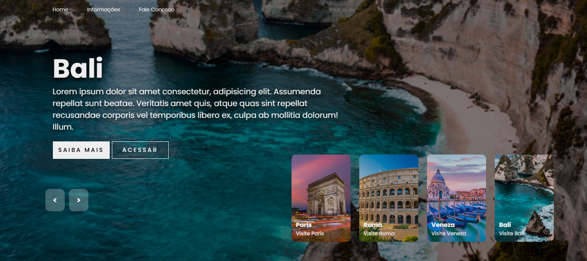
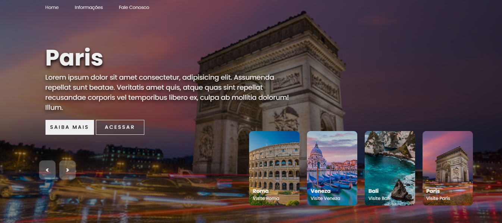
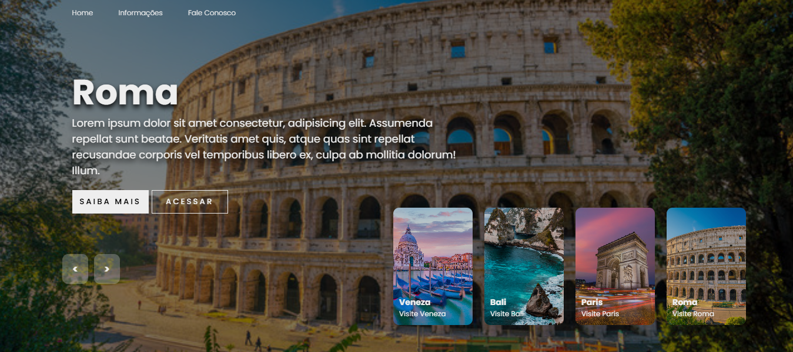
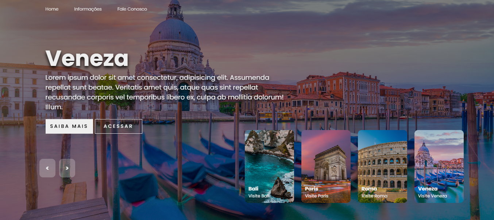

# 🌍 DevClub - Slider

Um projeto de **slider/carrossel animado** desenvolvido com **HTML, CSS e JavaScript**.  
Nele é possível navegar entre diferentes destinos turísticos com efeitos visuais modernos e animações suaves.

---

## 📸 Preview

### 🔹 Versão Desktop
<div>
  
  
  
  
</div>

### 🔹 Demonstração em GIF


---

## 🚀 Tecnologias Utilizadas:

- **HTML5**
- **CSS3**
- **JavaScript (Vanilla)**

---

## 🌐 Acesse o Projeto:

🔗 [Clique aqui para ver online](https://seu-usuario.github.io/seu-repo/)

---

## ⚙️ Funcionalidades:

- Navegação manual com botões **Próximo** e **Anterior**.
- Thumbnails interativas dos destinos.  
- Animações suaves nos títulos, descrições e imagens.  

---

## 📂 Estrutura do Projeto:

├── index.html
<br>
├── styles.css
<br>
├── scripts.js
<br>
└── img/
  <br>
  ├── img1.jpg 
  <br>
  ├── img2.jpg
  <br>
  ├── img3.jpg
  <br>
  ├── img4.jpg

yaml
Copiar código

---

## ✨ Como rodar localmente

1. Clone este repositório:
   ```bash
   git clone https://github.com/seu-usuario/seu-repo.git
Abra o arquivo index.html no navegador.

👨‍💻 Autor
Feito por Rodolfo Mori / Canal Devclub.
